# 📱 WhatsApp Integration Guide

> **Status**: 🚧 In Development  
> **Last Updated**: January 2025  
> **Estimated Setup Time**: 2-3 hours  
> **Difficulty**: Intermediate  

## 📋 Table of Contents

- [Overview](#overview)
- [Prerequisites](#prerequisites)
- [Meta Developer Setup](#meta-developer-setup)
- [Environment Configuration](#environment-configuration)
- [File Structure](#file-structure)
- [Implementation Steps](#implementation-steps)
- [Testing & Debugging](#testing--debugging)
- [Customer Journey Flow](#customer-journey-flow)
- [Business Owner Experience](#business-owner-experience)
- [Advanced Features](#advanced-features)
- [Troubleshooting](#troubleshooting)
- [Production Deployment](#production-deployment)

## 🎯 Overview

YapaNow's WhatsApp integration provides automated order notifications and customer communication through the WhatsApp Business API. This creates a seamless experience from order placement to completion.

### **Key Features**
- ✅ **Instant order confirmations** sent to customers
- ✅ **Real-time status updates** (preparing → ready → completed)
- ✅ **Business owner notifications** for new orders
- ✅ **Bilingual support** (Spanish/English)
- ✅ **Customer service integration** for inquiries
- ✅ **Rate limiting and error handling**

### **Business Value**
- **Customer Satisfaction**: Instant communication builds trust
- **Operational Efficiency**: Automated notifications reduce manual work
- **Competitive Advantage**: WhatsApp is preferred in Mexico and Latin America
- **Order Tracking**: Customers can easily check order status

## 🛠️ Prerequisites

### **Required Accounts**
- [ ] Meta Developer Account (Facebook/Instagram)
- [ ] WhatsApp Business Account
- [ ] Netlify Account (for hosting functions)
- [ ] Phone number for WhatsApp Business verification

### **Technical Requirements**
- [ ] Node.js 18+ 
- [ ] React/TypeScript project
- [ ] Netlify Functions support
- [ ] Environment variables configuration

### **Knowledge Requirements**
- Basic understanding of webhooks
- REST API concepts
- React hooks and state management
- Environment variable configuration

## 🏗️ Meta Developer Setup

### **Step 1: Create Meta Developer Account**

1. **Navigate to Meta for Developers**
   ```
   https://developers.facebook.com/
   ```

2. **Create Account**
   - Click "Get Started"
   - Use your Facebook account or create new one
   - Complete developer registration
   - Verify phone number

3. **Business Verification** (Required for WhatsApp)
   - Provide business information
   - Upload business documents
   - Wait for verification (1-3 business days)

### **Step 2: Create WhatsApp Business App**

1. **Create New App**
   ```
   Dashboard → Create App → Business → Create App
   ```

2. **App Configuration**
   ```
   App Name: "YapaNow WhatsApp Integration"
   Contact Email: your-business-email@domain.com
   Business Manager: [Select or create]
   ```

3. **Add WhatsApp Product**
   ```
   App Dashboard → Add Product → WhatsApp → Set Up
   ```

### **Step 3: Configure WhatsApp Business Platform**

1. **Add Phone Number**
   ```
   WhatsApp → Getting Started → Add Phone Number
   ```
   - Use a phone number not registered with WhatsApp personal
   - Verify with SMS/call
   - Accept WhatsApp Business terms

2. **Get Credentials**
   ```
   WhatsApp → API Setup → Copy these values:
   
   Phone Number ID: 123456789012345
   Access Token: EAAB...
   App ID: 987654321
   App Secret: abc123...
   ```

3. **Create Webhook Verify Token**
   ```
   Create a secure random string (recommended):
   VerifyToken: WhatsApp_YapaNow_2025_SecureToken123
   ```

## ⚙️ Environment Configuration

### **Environment Variables**

Create/update your `.env` file:

```env
# WhatsApp Business API Configuration
VITE_WHATSAPP_API_BASE_URL=https://graph.facebook.com/v18.0
VITE_WHATSAPP_PHONE_NUMBER_ID=your_phone_number_id_here
VITE_WHATSAPP_ACCESS_TOKEN=your_access_token_here
VITE_WHATSAPP_WEBHOOK_VERIFY_TOKEN=your_secure_verify_token_here

# Server-side Environment Variables (Netlify Functions)
WHATSAPP_API_BASE_URL=https://graph.facebook.com/v18.0
WHATSAPP_PHONE_NUMBER_ID=your_phone_number_id_here
WHATSAPP_ACCESS_TOKEN=your_access_token_here
WHATSAPP_WEBHOOK_VERIFY_TOKEN=your_secure_verify_token_here

# Business Configuration
WHATSAPP_BUSINESS_NAME="YapaNow"
WHATSAPP_BUSINESS_PHONE="+52 33 1234-5678"

# Development/Production Flags
NODE_ENV=development
WHATSAPP_DEBUG=true
```

### **Netlify Environment Variables**

Add these in Netlify Dashboard → Site Settings → Environment Variables:

```
WHATSAPP_API_BASE_URL = https://graph.facebook.com/v18.0
WHATSAPP_PHONE_NUMBER_ID = [your_phone_number_id]
WHATSAPP_ACCESS_TOKEN = [your_access_token]
WHATSAPP_WEBHOOK_VERIFY_TOKEN = [your_verify_token]
WHATSAPP_BUSINESS_NAME = YapaNow
WHATSAPP_BUSINESS_PHONE = +52 33 1234-5678
```

## 📁 File Structure

Your project should have this structure for WhatsApp integration:

```
src/
├── components/
│   └── whatsapp/
│       ├── WhatsAppProvider.tsx          # Context provider
│       ├── WhatsAppToggle.tsx            # Enable/disable toggle
│       └── WhatsAppStatusIndicator.tsx   # Status display
├── hooks/
│   └── useWhatsAppNotifications.ts       # WhatsApp logic hook
├── services/
│   └── whatsappService.ts                # API service layer
├── types/
│   └── whatsapp.ts                       # TypeScript definitions
└── utils/
    └── whatsappUtils.ts                  # Helper functions

netlify/
└── functions/
    ├── whatsapp-webhook.mjs              # Webhook handler
    ├── send-whatsapp-message.mjs         # Message sender
    └── whatsapp-business-notify.mjs      # Business notifications
```

## 🚀 Implementation Steps

### **Phase 1: Dependencies & Basic Files (15 minutes)**

1. **Install Dependencies**
   ```bash
   npm install axios
   npm install @types/node --save-dev
   ```

2. **Create Directory Structure**
   ```bash
   mkdir -p src/components/whatsapp
   mkdir -p src/hooks
   mkdir -p src/services
   mkdir -p src/types
   mkdir -p src/utils
   mkdir -p netlify/functions
   ```

3. **Create Core Files**
   ```bash
   # Core service files
   touch src/services/whatsappService.ts
   touch src/hooks/useWhatsAppNotifications.ts
   touch src/components/whatsapp/WhatsAppToggle.tsx
   touch src/types/whatsapp.ts
   
   # Netlify functions
   touch netlify/functions/whatsapp-webhook.mjs
   touch netlify/functions/send-whatsapp-message.mjs
   ```

### **Phase 2: Service Layer Implementation (30 minutes)**

1. **Copy WhatsApp Service** (from artifacts in previous conversation)
   - Copy `whatsappService.ts` content
   - Includes rate limiting, error handling, and message queuing

2. **Create Type Definitions**
   ```typescript
   // src/types/whatsapp.ts
   export type WhatsAppStatus = 'idle' | 'sending' | 'sent' | 'error';

   export interface OrderData {
     order_id: string;
     customer_name: string;
     customer_phone: string;
     store_name: string;
     store_address: string;
     store_phone: string;
     total_amount: number;
     currency: string;
     status: string;
     items: Array<{
       name: string;
       quantity: number;
       price: number;
     }>;
     delivery_address: string;
     special_instructions?: string;
     payment_method: string;
     language?: 'es' | 'en';
   }
   ```

3. **Implement Webhook Handler**
   - Copy `whatsapp-webhook.mjs` content
   - Handles incoming messages and status updates

### **Phase 3: React Integration (30 minutes)**

1. **Create WhatsApp Hook**
   ```typescript
   // src/hooks/useWhatsAppNotifications.ts
   // Copy from previous artifacts - handles notification logic
   ```

2. **Create Toggle Component**
   ```typescript
   // src/components/whatsapp/WhatsAppToggle.tsx
   // Copy from previous artifacts - user enable/disable control
   ```

3. **Update OrderPage Integration**
   - Add WhatsApp toggle to cart section
   - Connect notification sending to order completion
   - Add status indicators for user feedback

### **Phase 4: Webhook Configuration (20 minutes)**

1. **Deploy Functions**
   ```bash
   # Commit and push to trigger Netlify deployment
   git add .
   git commit -m "Add WhatsApp integration"
   git push origin main
   ```

2. **Configure Webhook in Meta Console**
   ```
   WhatsApp → Configuration → Webhook
   
   Callback URL: https://yapanow.netlify.app/.netlify/functions/whatsapp-webhook
   Verify Token: [your_verify_token_from_env]
   
   Subscribe to:
   ✅ messages
   ✅ message_deliveries
   ✅ message_reads
   ✅ message_echoes
   ```

3. **Test Webhook Connection**
   - Click "Verify and Save"
   - Should show "Connected" status
   - Check Netlify function logs for verification

## 🧪 Testing & Debugging

### **Phase 1: Webhook Testing**

1. **Verify Webhook Connection**
   ```bash
   # Check Netlify function logs
   netlify functions:logs whatsapp-webhook
   ```

2. **Test with Curl**
   ```bash
   curl -X POST https://yapanow.netlify.app/.netlify/functions/whatsapp-webhook \
     -H "Content-Type: application/json" \
     -d '{"test": "webhook"}'
   ```

### **Phase 2: Message Sending**

1. **Test Order Confirmation**
   - Place a test order with your phone number
   - Check WhatsApp for confirmation message
   - Verify message format and content

2. **Test Business Notification**
   - Use store owner's phone number
   - Verify business receives new order alert
   - Check message includes all order details

### **Phase 3: Error Handling**

1. **Test Invalid Phone Numbers**
   ```javascript
   // Should handle gracefully without crashing
   sendMessage('invalid-phone', message)
   ```

2. **Test Rate Limiting**
   ```javascript
   // Send multiple messages quickly
   // Should queue and throttle appropriately
   ```

3. **Test Network Failures**
   - Temporarily disable internet
   - Verify error messages appear in UI
   - Check retry logic works

## 🛍️ Customer Journey Flow

### **Complete User Experience**

```mermaid
sequenceDiagram
    participant C as Customer
    participant W as Website
    participant WA as WhatsApp API
    participant S as Store Owner

    C->>W: Places order
    W->>W: Validates order
    W->>WA: Send confirmation
    WA->>C: "¡Orden confirmada! #12345"
    W->>WA: Notify business
    WA->>S: "Nueva orden: Juan - $25"
    
    S->>WA: Update status "preparing"
    WA->>C: "👨‍🍳 Preparando tu orden"
    
    S->>WA: Update status "ready"
    WA->>C: "🎉 ¡Orden lista!"
    
    S->>WA: Update status "completed"
    WA->>C: "⭐ Orden completada"
```



### **Message Templates**

**Order Confirmation (Spanish)**
```
✅ ¡Orden Confirmada!

Hola [CUSTOMER_NAME]!

Tu orden #[ORDER_ID] ha sido confirmada.

📋 Resumen:
• [ITEM_NAME] x[QUANTITY] - $[PRICE]

💰 Total: $[TOTAL_AMOUNT] MXN
🕐 Tiempo estimado: [ESTIMATED_TIME]

📍 [STORE_NAME]
[STORE_ADDRESS]

¡Gracias por tu orden!
```

**Business Notification**
```
🆕 Nueva Orden Recibida

📋 Orden #[ORDER_ID]

👤 Cliente: [CUSTOMER_NAME]
📞 Teléfono: [CUSTOMER_PHONE]

🛍️ Productos:
• [ITEM_NAME] x[QUANTITY] - $[PRICE]

💰 Total: $[TOTAL_AMOUNT]
📍 Entrega: [DELIVERY_ADDRESS]
💳 Pago: [PAYMENT_METHOD]

Responde para actualizar estado
```

## 🏪 Business Owner Experience

### **Notification Management**

1. **New Order Alerts**
   - Instant WhatsApp notification
   - Complete order details
   - Customer contact information
   - Payment method confirmation

2. **Status Updates**
   - Reply to WhatsApp to update status
   - Automated customer notifications
   - Real-time order tracking

3. **Customer Communication**
   - Direct line to customer via WhatsApp
   - Handle special requests
   - Resolve order issues quickly

### **Business Dashboard Integration** (Future)

```typescript
// Future enhancement - Business dashboard
const BusinessDashboard = () => {
  const { orders, updateOrderStatus } = useOrderManagement();
  
  const handleStatusUpdate = (orderId, status) => {
    updateOrderStatus(orderId, status);
    // Automatically sends WhatsApp update to customer
  };
};
```

## 🚀 Advanced Features

### **Interactive Messages** (Future Enhancement)

```typescript
// Quick action buttons in WhatsApp
const interactiveMessage = {
  type: 'interactive',
  interactive: {
    type: 'button',
    body: {
      text: 'Tu orden está lista. ¿Cómo prefieres recibirla?'
    },
    action: {
      buttons: [
        { id: 'pickup', title: 'Recoger' },
        { id: 'delivery', title: 'Entrega' }
      ]
    }
  }
};
```

### **Rich Media Messages** (Future Enhancement)

```typescript
// Send images with orders
const mediaMessage = {
  type: 'image',
  image: {
    link: 'https://yapanow.netlify.app/images/order-ready.jpg',
    caption: '¡Tu orden está lista! 🎉'
  }
};
```

### **Conversational Ordering** (Future Enhancement)

```typescript
// Allow orders via WhatsApp chat
const handleIncomingOrder = (message) => {
  if (message.includes('quiero ordenar')) {
    // Start conversational ordering flow
    sendMenuOptions(customerPhone);
  }
};
```

## 🔧 Troubleshooting

### **Common Issues**

#### **1. Webhook Not Working**
```bash
# Symptoms: No incoming messages processed
# Check:
- Webhook URL correct in Meta Console
- Verify token matches environment variable
- Check Netlify function logs for errors
- Test webhook with curl

# Solution:
curl -X GET "https://yapanow.netlify.app/.netlify/functions/whatsapp-webhook?hub.mode=subscribe&hub.challenge=test&hub.verify_token=[YOUR_TOKEN]"
```

#### **2. Messages Not Sending**
```bash
# Symptoms: No WhatsApp messages received
# Check:
- Access token validity
- Phone number format (+52...)
- WhatsApp Business API quota
- Function logs for API errors

# Debug:
console.log('WhatsApp API Response:', response);
```

#### **3. Rate Limiting Issues**
```bash
# Symptoms: Some messages fail
# Check:
- Service health status
- Message queue size
- API rate limits (80/minute)

# Monitor:
const health = whatsappService.getServiceHealth();
console.log('Queue size:', health.queueSize);
```

#### **4. Template Approval Issues**
```bash
# Symptoms: Template messages rejected
# Solutions:
- Keep templates business-focused
- Avoid promotional language
- Follow WhatsApp guidelines
- Allow 24-48 hours for approval
```

#### **5. Phone Number Formatting Bug** ⚠️ **CRITICAL**
```bash
# Symptoms: Messages show as "sent" but customers don't receive them
# Root Cause: Digit dropped from Mexico phone numbers during formatting

# Example of the bug:
Input:  +523315590572 (correct 12-digit Mexico number)
Output: +52315590572  (incorrect 11-digit number - missing '3')

# This was caused by flawed logic in formatPhoneNumber functions:
# OLD (BUGGY) CODE:
if (cleaned.startsWith('52')) return cleaned; // ❌ Too simplistic!

# NEW (FIXED) CODE:
if (cleaned.startsWith('52')) {
    if (cleaned.length === 12) {
        return cleaned; // ✅ Properly formatted Mexico number
    } else if (cleaned.length === 11) {
        console.error(`Invalid Mexico phone number length: ${phone}`);
        return cleaned; // Log the bug for debugging
    }
}

# Files that were fixed:
- src/services/whatsappService.ts
- netlify/functions/send-whatsapp-message.ts

# Prevention:
- Always validate Mexico numbers have exactly 12 digits (52 + 10 digits)
- Use comprehensive logging to catch formatting issues
- Test with real Mexico phone numbers during development
```

### **Debug Tools**

#### **Service Health Check**
```typescript
// Check WhatsApp service status
const healthStatus = whatsappService.getServiceHealth();
console.log({
  queueSize: healthStatus.queueSize,
  cacheSize: healthStatus.cacheSize,
  isProcessing: healthStatus.isProcessing
});
```

#### **Message Logs**
```typescript
// Enable debug logging
WHATSAPP_DEBUG=true

// View message history
localStorage.getItem('whatsapp_message_log');
```

## 🌐 Production Deployment

### **Pre-deployment Checklist**

- [ ] **Environment Variables Set**
  - All WhatsApp credentials in Netlify
  - Production access tokens
  - Webhook verify token

- [ ] **Business Verification Complete**
  - Meta Business verification approved
  - WhatsApp Business profile complete
  - Phone number verified

- [ ] **Message Templates Approved**
  - Order confirmation template
  - Status update templates
  - Business notification template

- [ ] **Testing Complete**
  - Webhook responds correctly
  - Messages send successfully
  - Error handling works
  - Rate limiting functions

- [ ] **Monitoring Setup**
  - Function logs monitoring
  - Error alerting configured
  - Health check endpoints

### **Go-Live Process**

1. **Soft Launch**
   ```typescript
   // Enable for limited users first
   const WHATSAPP_ENABLED_USERS = ['+52...', '+1...'];
   
   if (WHATSAPP_ENABLED_USERS.includes(customerPhone)) {
     await sendWhatsAppNotification(orderData);
   }
   ```

2. **Monitor Initial Usage**
   - Watch function logs closely
   - Monitor message delivery rates
   - Check customer feedback

3. **Gradual Rollout**
   ```typescript
   // Gradually increase percentage
   const ROLLOUT_PERCENTAGE = 25; // Start with 25%
   
   if (Math.random() * 100 < ROLLOUT_PERCENTAGE) {
     await sendWhatsAppNotification(orderData);
   }
   ```

4. **Full Launch**
   - Enable for all customers
   - Monitor performance metrics
   - Gather user feedback

### **Success Metrics**

Track these KPIs:

- **Message Delivery Rate**: >95% success
- **Customer Response Rate**: % who reply to notifications
- **Order Completion Time**: Faster with notifications
- **Customer Satisfaction**: Survey feedback
- **Business Efficiency**: Faster order processing

## 📞 Support & Resources

### **Official Documentation**
- [WhatsApp Business API Docs](https://developers.facebook.com/docs/whatsapp)
- [Meta for Developers](https://developers.facebook.com/)
- [Netlify Functions Guide](https://docs.netlify.com/functions/overview/)

### **Community Resources**
- [WhatsApp Business API Community](https://developers.facebook.com/community/whatsapp-business/)
- [Stack Overflow WhatsApp Tag](https://stackoverflow.com/questions/tagged/whatsapp)

### **Internal Support**
- Check `docs/ERROR_BOUNDARIES.md` for error handling
- Review `docs/ARCHITECTURE.md` for component structure
- See function logs in Netlify dashboard

---

## 🎉 Congratulations!

Once implemented, your WhatsApp integration will provide:

- ✅ **Instant customer communication**
- ✅ **Automated order notifications** 
- ✅ **Professional business messaging**
- ✅ **Competitive advantage in Mexican market**
- ✅ **Improved customer satisfaction**

Your YapaNow platform is now ready to provide world-class customer communication! 🚀📱